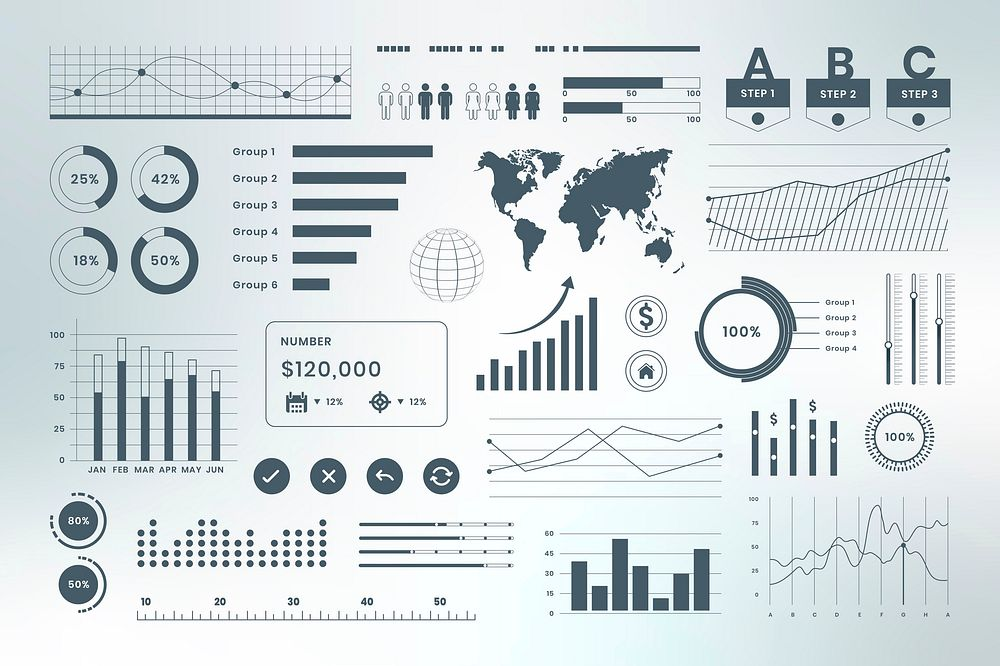

  

###

  
  
  

###

<h1 align="center">Hey there 👋, I'm Altagi Abdallah</h1>

###

<h3 align="left">👨‍💻 About Me</h3>

  📠Computer Science student at Albukhary International University (AIU) 
  🌠From Sudan 🇸🇩, based in Malaysia 🇲🇾  
  🔭 Currently serving as Vice President of the Sudanese Students Community @ AIU 
  ✨ Actively involved in using tech and AI to support education, health, and community development 
  👨‍🎨 Media and Graphic Designer with experience in organizing community campaigns and events 
  💡 Passionate about building AI-powered tools that solve real-world problems 
  🧠 Working on projects in ML, web apps, and healthcare prediction systems (lung cancer classifier, accident analysis) 
  🌱 Currently learning full-stack development, data analysis, Flask, and SVM for image classification 
  🤝 Open to collaboration on AI for Social Good, student platforms, and awareness tools

###

<h3 align="left">🛠️ Languages, Tools & Technologies</h3>

  
  
  
  
  
  
  
  
  
  

  
  
  
  
  
  
  
  
  
  
  

  
  
  

###

<h3 align="left">📌 Notable Contributions & Projects</h3>

- 🧠 **Lung Cancer Detection using SVM** — Image classifier to detect Benign, Malignant, or Normal CT scans using Python, Colab, and OpenCV  
- 🚦 **Traffic Accident Prediction System** — Analyzed factors like weather, road type, and alcohol influence to predict accident severity  
- 🌐 **Pharmacy Info Web App** — Flask-based app that helps users reach pharmacists and learn about medical equipment  
- 🎨 **Media Lead** for AIU Sudanese Students and Hult Prize events — posters, videos, campaigns  
- 🎓 **Educational Research** on mobile phone distractions, SDG 4, and global education challenges  
- 💬 **Event Organizer & Host** for national celebrations and tech awareness programs  
- 🌱 **My Net-Zero Diary** contributor — focusing on sustainable living and youth action on climate change

###

<h3 align="center">🌟 Let's Connect and Build Something Meaningful Together!</h3>
